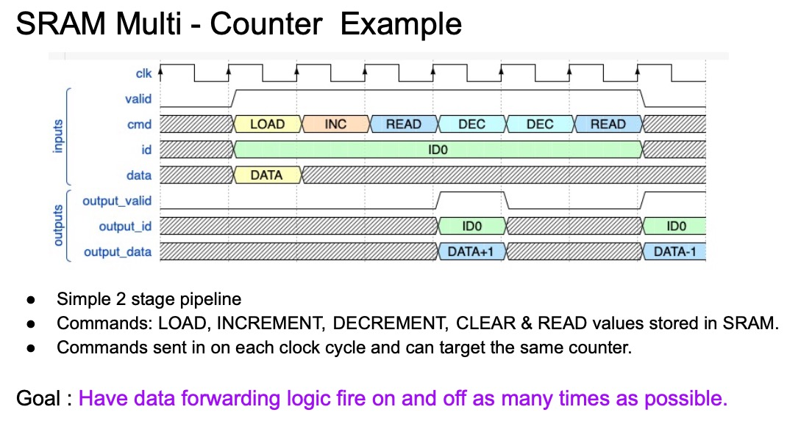
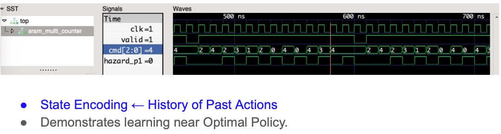

## State encoding exercise

In this example the state is encoded as the history of past actions.
Does this state encoding allow the agent to learn ?

Simple 2 stage pipeline with commands to
load,increment,decrement,clear and read count values stored in SRAM.
An ID sent with the command selects the counter.

Commands sent in on each clock cycle and can target the same 
counter. This requires data forwarding logic.

Goal is to have this logic fire on and off as many times as possible.
Signal used is hazard_p1.

## Instructions to run:

1. Start docker container: 
   * docker run -it -v $PWD:/work siliconbootcamp/verilator-cocotb:latest
   * The locally-cloned-directory will be mounted under /work in the docker container

2. ./run.sh

